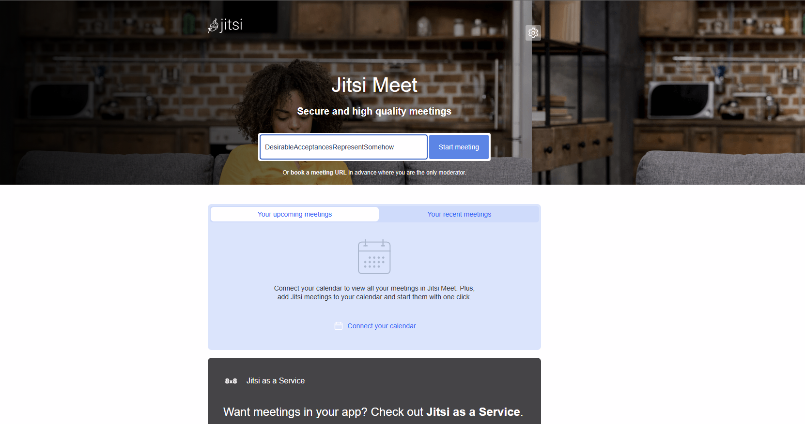
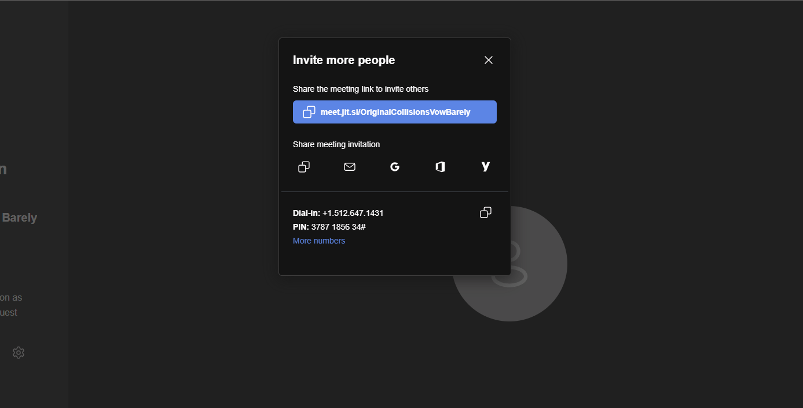
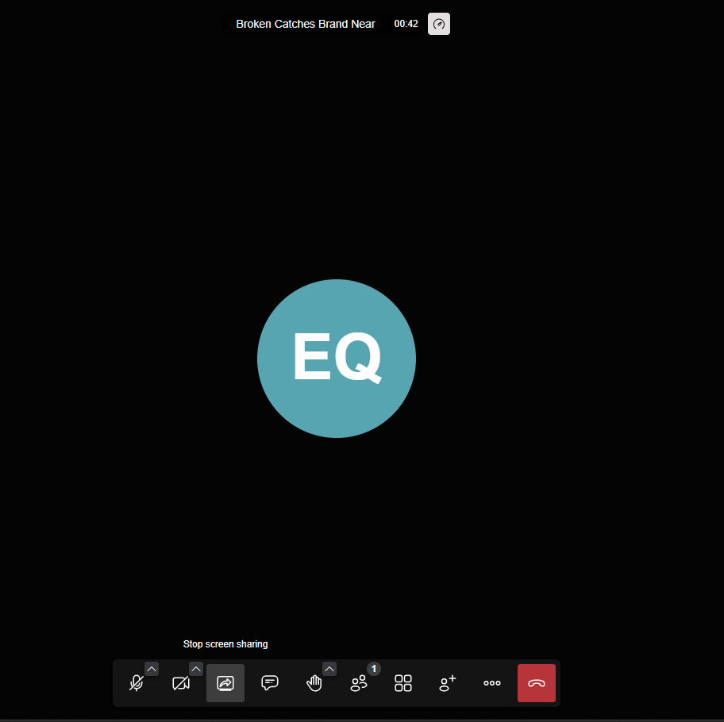

# 📘 Jitsi Meet Quick Start Guide

**Audience**: First-time users of Jitsi Meet (desktop browser version)  
**Product**: [Jitsi Meet](https://meet.jit.si/) – free, open-source video conferencing

---

## ✅ What Is Jitsi Meet?

Jitsi Meet is a secure, open-source video conferencing app that runs in your browser. No downloads or accounts needed.

---

## 🚀 Starting a Meeting

1. Visit [https://meet.jit.si](https://meet.jit.si)
2. Enter a unique meeting name (e.g., `team-daily-standup`)
3. Click **Start meeting**
4. Allow access to your **camera** and **microphone** if prompted

---

## 🔗 Inviting Others

- Click the **info icon** (top right)
- Copy the meeting link and share it with participants

  

---

## 🖥️ Sharing Your Screen

1. Click the **screen icon** at the bottom
2. Choose what to share:
   - Entire screen
   - Window
   - Chrome tab
3. Click **Share**

> 📌 Tip: Only one person can share their screen at a time.

---

## 🔒 Privacy Tips

- Click the shield icon 🔒 to:
  - Set a password for the room
  - See if encryption is active
- Use a **unique room name** to prevent uninvited guests

  

---

## 💡 Tips for Teams

- Use the **chat panel** for silent questions
- Enable **“Raise Hand”** in large meetings
- Mute yourself when not speaking

---

## 🧠 Need More Help?

Visit the official documentation:  
➡️ [Jitsi Meet Help](https://jitsi.github.io/handbook/docs/user-guide/user-guide-start-a-jitsi-meeting)

---

*Created for portfolio demonstration purposes. Jitsi Meet is an open-source project by the 8x8 team.*

